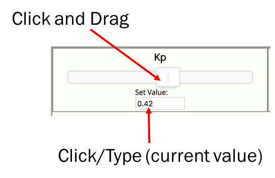
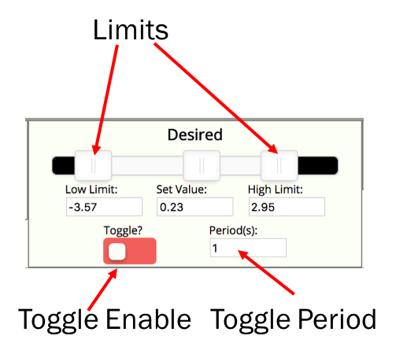
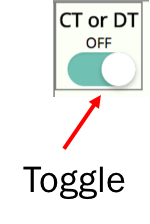
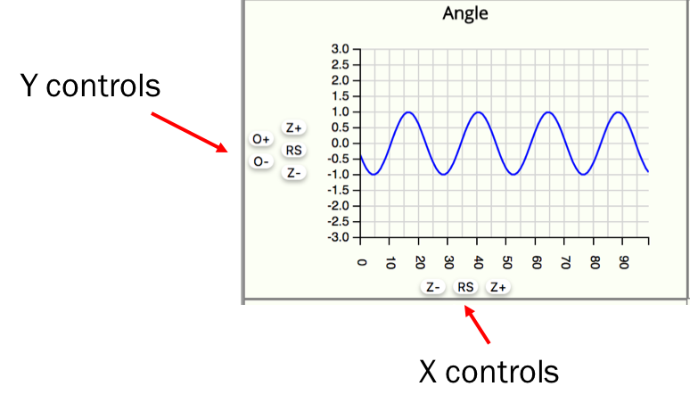
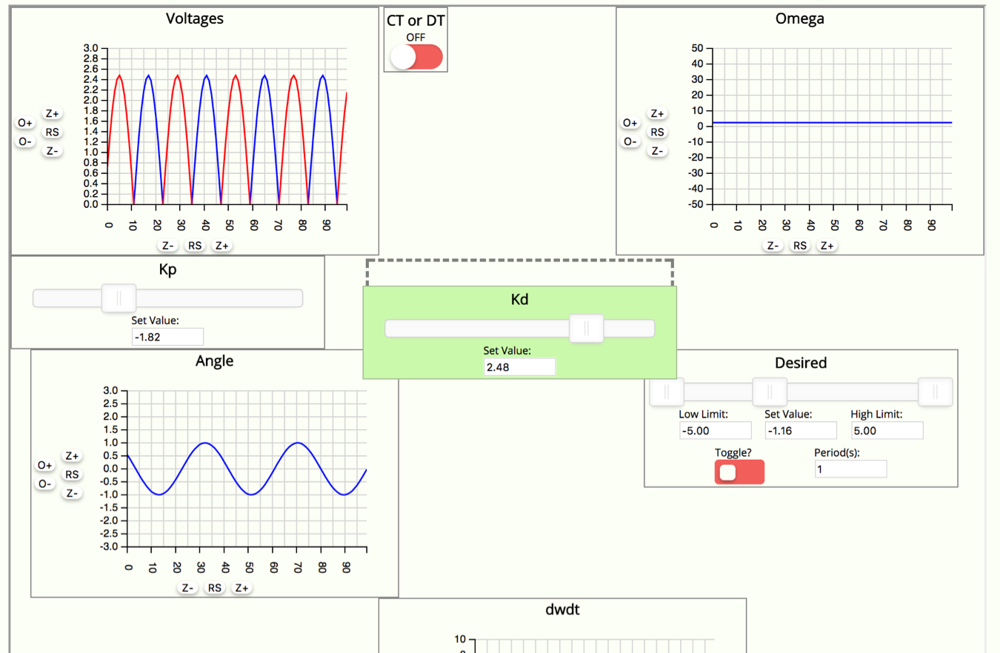

# Overview of new System

This new interface utilizes direct websocket connection between the ESP32 and a hosted website.  It should require minimal installation on the part of the student (no Python, Flask, or threading cludges.)

The only thing it requires are two libraries to be installed in your Arduino IDE.  To do this move a copy of the `Six302` library and a copy of the `ESP32-Websocket` library to your library folder for you Arduino (on Mac this is usually located under `Documents>Arduino>libraries`).

Once installed, you only need to include the `Six302` library and then go to a site that hosts the GUI backend (note you can either do this locally with a Python Flask server if you'd like) or a remotely-hosted site.

## Interfacing

Compared to the previous two years of 6302View, version 3 is far more streamlined.  An example script is shown below.


```
#include <Six302.h>
#include <math.h>


CommManager cm(1000,25000); //create instance of commManager

//Create incoming control variables, parameters, etc...
float Kp;
float Kd;
float desired;
float ct_or_dt;

//Create outgoing variables for control and plotting...
float angle;
float omega;
float dwdt;
float vms[2];
int loop_count;

void setup()
{
    delay(500); //initial wait for safety
    Serial.begin(115200);//set up serial
    cm.connect("router","password"); //connect to router using password!
    cm.addSlider("Kp",-5,5,0.1,false, &Kp); //add a slider called Kp and link it to variable Kp
    cm.addSlider("Kd",-5,5,0.1,false, &Kd); //add a slider called Kd and link it to variable Kd
    cm.addSlider("Desired",-5,5,0.1,true, &desired); // similar...
    cm.addToggle("CT or DT", &ct_or_dt); 
    cm.addPlot("Angle",-3,3,100, &angle); //add a plotter called "Angle" and link it to variable angle
    cm.addPlot("Omega",-50,50,100, &omega); //similar...
    cm.addPlot("dwdt",-10,10,100, &dwdt); //similar...
    cm.addPlot("Voltages",0,3,100, vms,2); //add a plotter (two plots in same window) called "Voltages" and link to vms array
    loop_count = 0;
}

void loop(){

  //User code here!  take in readings, update values, etc...should be all good.
  //below is just some random math/linking/relationships of inputs to outputs for demos
  //normally you'd do your analog readings, and legit stuff here.
  //
  angle = cos(millis()*0.001*6.28);
  omega = Kd;
  dwdt = ct_or_dt?cos(millis()*0.1):1;
  vms[0] = Kd*cos(millis()*0.01);
  vms[1] = -vms[0];

  cm.step(); //call once per loop. Blocks until step duration has occurred.
}
```

The system operation is built around the `CommManager` class which handles all timing, communication, and value distribution tasks that were previously wound up in a bunch of spaghetti code.  It requires a certain structure to your code in order for it to work. In particular, it requires the user to set up a minimum of two types of `float` data types.  The first set are incoming control variables, these are variables that will be set and varied by the GUI.  The user can change these, but be aware that hte GUI is also changing them so in the main body of the code you do not have full control over these.

The second type of variable are outgoing values. These are values which you have full-control over in the main loop, and which are reported back to the GUI.  

It is entirely possible to have a single variable be associated with an incoming signal and an outgoing signal.  

We use pointers to link to these two classes of variables, minimizing the need for the user to do explicit assignments/function calls in loop and keeping the code decluttered. 

You start off by making an object based off the `CommManager` class. At instantiation you specify two critical values: the control loop period (in microseconds) and the reporting loop period (in microseconds).  The former must be shorter than the latter. Assuming we call this object `cm`, upon instantiation, you can either rely on default by simply doing `CommManager cm;` (which falls back to a 1000 us control loop period and 20000 us reporting loop period) or via specifying values like so: `CommManager cm(1000,25000);` which gives a 1000 us control loop period and 25000 us reporting loop period.

After that there's not much to do with the object other than add different input/output widgets using member function calls on the `CommManager` object.  These must be done in the `setup()` function.  Details and their results below:


## Creation of Widgets

There are four three primary widgets: Plots, Sliders, and Toggles.  Sliders have two sub-types depending on needs of the user. When you declare a slider you use the following format.  The first argument is the title of the slider, then the lower and upper bounds, the slider-resolution, the toggle argument (more on that below), and then the address of the variable you want linked to that slider (meaning every time you change the slider in the gui that variable will get updated.) 


```
cm.addSlider("Kp",-5,5,0.1,false, &Kp);
```

This particular call results in the following slider being built:

<center>
	
</center>


The fifth argument above that was `false` is for enabling a toggling feature.  When that is set to be `true`, the slider builds differently.

```
cm.addSlider("Desired",-5,5,0.1,true, &desired);
```

It ends up looking like the image below. It is still a standard slider, but in addition, there are two limits that can be adjusted, and then when you turn on the toggle switch in the widget, the slider will start to alternate between those two limits with a half-period specified by the labeled field (this behavior is all in javascript so looks like the user is doing it from the perspective of the ESP32)

<center>
	
</center>


The next thing you can add is a toggle switch and it is basically a binary slider. This also needs a pointer to a float (to make type-handling easier), but the linked variable will only be `1.0` or `0.0`.

```
cm.addToggle("CT or DT", &ct_or_dt); 
```

It results in the following widget that should be pretty self-explanatory:

<center>
	
</center>

The previous two things have been user-controlled inputs to the system under control.  This final one is an output, allowing real-time reporting of values.  To make a plot you need to do the following where the title is the first argument, the vertical limits are the second and third, the horizontal count is the fourth and a reference to the data being reported is the final argument.

```
cm.addPlot("Angle",-3,3,100, &angle);

```

When the call above is run, you get the following:

<center>
	
</center>


If you wish to make a multiple-trace plot, you need to give it the following:

```
cm.addPlot("Voltages",0,3,100, vms,2);
```

Note that in this case, the pointer argument provided refers to an `float` array, and the final argument (unused in a single-trace plot) refers to how many traces are involved.  Each trace will be given a different color in the plot, in the order of blue, red, green, yellow, and purple.

#Running Everything

When you've got a handle on everything the basic order of operations is as follows:

* Upload your code to the ESP32 with a valid 2.4 GHz wireless access point and password included.  Upon startup in the serial monitor it will print out the IP address assigned to the ESP32.
* Head on over to your GUI, enter that IP address into the appropriate field, and then press connect. Within a second or two, the gui elements will have built and all will be right with the world.  Plots should immediately start running.


##CSV

The ability to record all data is facilitated through the `CSV Generate?` button at the top of the page.  Upon pressing this, at every update step (every time the graphs on the page update), all current values of inputs (sliders and toggle switches) as well as the newest set of outputs (the plot values) will be appended to a CSV row.  A header for identification purposes is automatically generated in the order INPUTS and then OUTPUTS based on their declaration order in the ESP32 code.  When you unclick the CSV button, the csv file will be generated using the name specified in the CSV name field and a timestamp.  

##Rearranging

While taking data if you get sick of the order of the widgets you can click on the `Grid Locked` toggle at the top left to enable dragging of gui elements.  To drag them, click and hold on the title of the element. As you move it, it will turn a light green and a dashed outline will show where you're moving it.  Other things will rearrange in a crappy way around where you're putting it.  Does this help much?  The more panels, the more it sort of does, but don't feel obligated to use it.


<center>
	
	<p>Draggin a slider around...</p>
</center>
